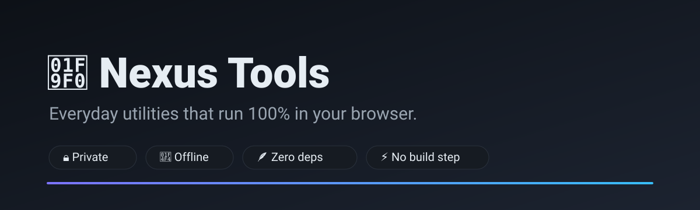

<div align="center">



# 🧰 Nexus Tools

**A fast, private, offline-first toolbox of everyday web utilities.**

No servers. No tracking. No build step. No dependencies. Just open it and go.

[**🚀 Live demo**](https://ducanvunguyen.github.io/nexus-builder/) · [Report a bug](https://github.com/ducanvunguyen/nexus-builder/issues) · [Request a tool](https://github.com/ducanvunguyen/nexus-builder/issues)


</div>

---

## ✨ Why Nexus Tools?

Most "online tool" sites are a swamp of ads, trackers, and pop-ups — and they quietly upload
whatever you paste into them. Nexus Tools is the opposite:

- 🔒 **Truly private** — every byte is processed on *your* device. Nothing is ever uploaded.
- 📴 **Works offline** — it's just static files. Save the page and use it on a plane.
- 🪶 **Zero dependencies** — no frameworks, no `node_modules`, no supply-chain risk.
- ⚡ **Instant** — no build step, no bundler. The whole app is a few small files.
- 🌗 **Beautiful** — clean UI, light & dark themes, keyboard-friendly, mobile-ready.

## 🧩 The toolbox

| | Tool | What it does |
|---|------|--------------|
| 🔐 | **Password Generator** | Strong random passwords with a live entropy strength meter |
| #️⃣ | **Hash Generator** | SHA-256 / SHA-1 / SHA-384 / SHA-512 via the Web Crypto API |
| 🆔 | **UUID Generator** | Bulk RFC-4122 v4 UUIDs |
| `{ }` | **JSON Formatter** | Beautify or minify JSON, with validation |
| 🔁 | **Base64** | Unicode-safe encode / decode |
| 🔗 | **URL Encode/Decode** | Percent-encode or decode URL components |
| 🔢 | **Number Base Converter** | Binary ↔ octal ↔ decimal ↔ hex |
| ⏱️ | **Timestamp Converter** | Unix time ↔ ISO 8601 |
| 🔤 | **Case Converter** | camelCase, snake_case, kebab-case, Title Case… |
| 🧮 | **Word Counter** | Words, characters, sentences, reading time |
| 📃 | **Line Tools** | Sort, deduplicate and reverse lines |
| 📝 | **Lorem Ipsum** | Placeholder text by words / sentences / paragraphs |
| 📏 | **Unit Converter** | Length, mass, temperature, time, data, speed |
| 🎨 | **Color Converter** | HEX ↔ RGB ↔ HSL with a live swatch |
| 🖼️ | **Image Compressor** | Resize & compress images entirely on-device |

## 🚀 Getting started

It's a static site, so there's nothing to install.

```bash
git clone https://github.com/ducanvunguyen/nexus-builder.git
cd nexus-builder

# Open it directly…
open index.html            # macOS (use "start" on Windows / "xdg-open" on Linux)

# …or serve it locally (recommended, so ES modules load cleanly):
npm run serve              # then visit http://localhost:8080
```

## 🧪 Tests

The logic lives in dependency-free pure functions in [`assets/js/tools.js`](assets/js/tools.js),
so it's fully unit-testable with the built-in Node test runner — no test framework required:

```bash
npm test
```

## 🏗️ How it's built

```
index.html            # app shell
assets/
  css/style.css       # theming + layout (CSS custom properties)
  js/
    tools.js          # pure, DOM-free logic  (imported by both the app and the tests)
    app.js            # UI layer: tool registry, hash router, DOM wiring
tests/
  tools.test.js       # node --test unit tests
```

The guiding principle: **keep all logic pure and DOM-free** so it can be tested in Node and
reused in the browser unchanged. The UI is a thin, data-driven layer over that logic.

## 🤝 Contributing

New tools are welcome and easy to add — write a pure function in `tools.js`, add a small
`render()` function in `app.js`, and register it in the `TOOLS` array. PRs and ideas welcome!

## 📄 License

Licensed under the [Apache 2.0](LICENSE) License.
